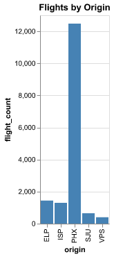
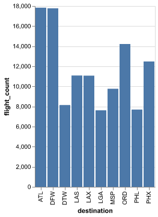
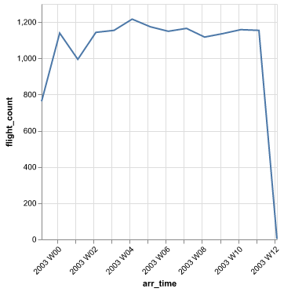
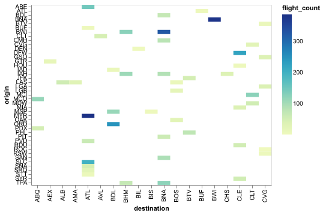
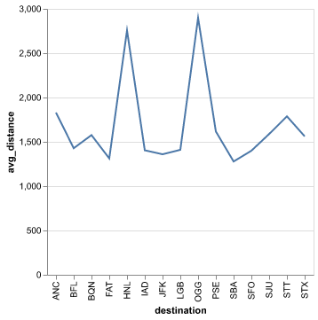
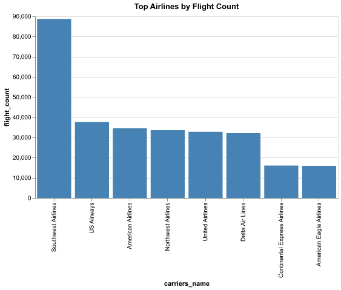

# Boring Semantic Layer (BSL)

The Boring Semantic Layer (BSL) is a lightweight semantic layer based on [Ibis](https://ibis-project.org/).

**Key Features:**
- **Lightweight**: `pip install boring-semantic-layer`
- **Ibis-powered**: Built on top of [Ibis](https://ibis-project.org/), supporting any database engine that Ibis integrates with (DuckDB, Snowflake, BigQuery, PostgreSQL, and more)
- **MCP-friendly**: Perfect for connecting Large Language Models to structured data sources


*This project is a joint effort by [xorq-labs](https://github.com/xorq-labs/xorq) and [boringdata](https://www.boringdata.io/).*

We welcome feedback and contributions!

# Quick Example

```
pip install 'boring-semantic-layer[examples]'
```

**1. Define your ibis input table**

```python
import ibis

# Create a simple in-memory table
flights_tbl = ibis.memtable({
    "origin": ["JFK", "LAX", "JFK", "ORD", "LAX"],
    "carrier": ["AA", "UA", "AA", "UA", "AA"]
})
```

**2. Define a semantic table**

```python
from boring_semantic_layer.semantic_api import to_semantic_table

flights = (
    to_semantic_table(flights_tbl, name="flights")
    .with_dimensions(origin=lambda t: t.origin)
    .with_measures(flight_count=lambda t: t.count())
)
```

**3. Query it**

```python
flights.group_by("origin").aggregate("flight_count").execute()
```

**Example output (dataframe):**

| origin | flight_count |
| ------ | ------------ |
| JFK    | 2            |
| LAX    | 2            |
| ORD    | 1            |


-----

## Table of Contents

- [Boring Semantic Layer (BSL)](#boring-semantic-layer-bsl)
- [Quick Example](#quick-example)
- [Installation](#installation)
- [Get Started](#get-started)
  - [1. Get Sample Data](#1-get-sample-data)
  - [2. Build a Semantic Table](#2-build-a-semantic-table)
  - [Adding Descriptions to Dimensions and Measures](#adding-descriptions-to-dimensions-and-measures)
  - [3. Query a Semantic Table](#3-query-a-semantic-table)
- [Features](#features)
  - [Filters](#filters)
  - [Advanced Queries](#advanced-queries)
    - [Percent of Total](#percent-of-total)
    - [Window Functions](#window-functions)
    - [Nested Data with nest()](#nested-data-with-nest)
  - [Joins Across Semantic Tables](#joins-across-semantic-tables)
    - [join_one (Many-to-One Relationships)](#join_one-many-to-one-relationships)
    - [join_many (One-to-Many Relationships)](#join_many-one-to-many-relationships)
    - [join_cross (Cross Product)](#join_cross-cross-product)
    - [YAML Configuration for Joins](#yaml-configuration-for-joins)
  - [Dimensional Indexing](#dimensional-indexing)
  - [Backward Compatibility: query() Method](#backward-compatibility-query-method)
  - [Backward Compatibility: Time-Based Dimensions](#backward-compatibility-time-based-dimensions)
- [Model Context Protocol (MCP) Integration](#model-context-protocol-mcp-integration)
  - [Installation](#installation-1)
  - [Setting up an MCP Server](#setting-up-an-mcp-server)
  - [Configuring Claude Desktop](#configuring-claude-desktop)
  - [Available MCP Tools](#available-mcp-tools)
- [Chart Visualization](#chart-visualization)
  - [Installation](#installation-2)
  - [How BSL Charting Works](#how-bsl-charting-works)
  - [Backend Selection](#backend-selection)
  - [Smart Chart Creation](#smart-chart-creation)
    - [1. Auto-detected Bar Chart](#1-auto-detected-bar-chart)
    - [2. Auto-detected Time Series Chart](#2-auto-detected-time-series-chart)
    - [3. Auto-detected Heatmap](#3-auto-detected-heatmap)
    - [4. Custom Mark with Auto-detection](#4-custom-mark-with-auto-detection)
    - [5. Full Custom Specification](#5-full-custom-specification)
  - [Export Formats](#export-formats)
- [Reference](#reference)
  - [SemanticTable API](#semantictable-api)
  - [YAML Configuration Reference](#yaml-configuration-reference)
  - [Chart API Reference](#chart-api-reference)

-----

## Installation

```bash
# Basic installation
pip install boring-semantic-layer

# For DuckDB support (used in examples)
pip install 'boring-semantic-layer[examples]'

# For MCP integration
pip install 'boring-semantic-layer[fastmcp]'

# For visualization with Altair
pip install 'boring-semantic-layer[viz-altair]'

# For visualization with Plotly
pip install 'boring-semantic-layer[viz-plotly]'
```

-----

## Get Started

### 1. Get Sample Data

We expose some test data in a public bucket. You can download it with:

```bash
curl -L https://pub-a45a6a332b4646f2a6f44775695c64df.r2.dev/flights.parquet -o flights.parquet
curl -L https://pub-a45a6a332b4646f2a6f44775695c64df.r2.dev/carriers.parquet -o carriers.parquet
```

**Note:** Examples use DuckDB, so install with: `pip install 'boring-semantic-layer[examples]'`

### 2. Build a Semantic Table

Define your data source and create a semantic table that describes your data in terms of dimensions and measures.

```python
import ibis
from boring_semantic_layer.semantic_api import to_semantic_table

# Connect to your database (here, DuckDB in-memory for demo)
con = ibis.duckdb.connect(":memory:")
flights_tbl = con.read_parquet("flights.parquet")
carriers_tbl = con.read_parquet("carriers.parquet")

# Define the semantic table
flights = (
    to_semantic_table(flights_tbl, name="flights")
    .with_dimensions(
        origin=lambda t: t.origin,
        destination=lambda t: t.dest,
        year=lambda t: t.year
    )
    .with_measures(
        total_flights=lambda t: t.count(),
        total_distance=lambda t: t.distance.sum(),
        avg_distance=lambda t: t.distance.mean(),
    )
)
```

- **Dimensions** are attributes to group or filter by (e.g., origin, destination).
- **Measures** are aggregations or calculations (e.g., total flights, average distance).

All dimensions and measures are defined as Ibis expressions.

Ibis expressions are Python functions that represent database operations.

They allow you to write database queries using familiar Python syntax while Ibis handles the translation to optimized SQL for your specific database backend (like DuckDB, PostgreSQL, BigQuery, etc.).

For example, in our semantic table:

- `lambda t: t.origin` is an Ibis expression that references the "origin" column
- `lambda t: t.count()` is an Ibis expression that counts rows
- `lambda t: t.distance.mean()` is an Ibis expression that calculates the average distance

The `t` parameter represents the table, and you can chain operations like `t.origin.upper()` or `t.dep_delay > 0` to create complex expressions. Ibis ensures these expressions are translated to efficient SQL queries.

### Adding Descriptions to Dimensions and Measures

BSL supports adding human-readable descriptions to dimensions and measures. This helps in documenting your data model and making it easier for others to understand and AI agents to interact with.

You can define dimensions and measures with descriptions by passing a dict with `expr` and `description` keys:

**Simple format:**
```python
flights = (
    to_semantic_table(flights_tbl, name="flights")
    .with_dimensions(origin=lambda t: t.origin)
    .with_measures(flight_count=lambda t: t.count())
)
```

**With descriptions (dict format):**
```python
from boring_semantic_layer.semantic_api import to_semantic_table

flights = (
    to_semantic_table(flights_tbl, name="flights")
    .with_dimensions(
        origin={
            "expr": lambda t: t.origin,
            "description": "Origin airport where the flight departed from"
        }
    )
    .with_measures(
        flight_count={
            "expr": lambda t: t.count(),
            "description": "Total number of flights"
        }
    )
)
```

**Why use descriptions?**
- **Human-readable**: Makes your models self-documenting for team members.
- **AI friendly**: Perfect for MCP agents and LLMs that need to understand your models in more detail and nuances between similar dimensions and measures.
- **Flexible**: You can mix simple lambdas and dict formats seamlessly.

**YAML Configuration Support:**

You can also define models with descriptions using YAML configuration files:

```yaml
flights:
  table: flights_tbl
  description: "Flight data with departure and arrival information"

  dimensions:
    # Simple format
    origin: _.origin

    # With description
    destination:
      expr: _.destination
      description: "Destination airport code where the flight arrived at"

  measures:
    # Simple format
    flight_count: _.count()

    # With description
    avg_distance:
      expr: _.distance.mean()
      description: "Average distance of flights in miles"
```

Load the YAML model:
```python
from boring_semantic_layer.semantic_api import from_yaml

models = from_yaml("flights_model.yml", tables={"flights_tbl": flights_tbl})
flights = models["flights"]
```

---

### 3. Query a Semantic Table

Use your semantic table to run queries—grouping by dimensions, aggregating measures, and applying filters or limits.

**Basic query:**
```python
flights.group_by('origin').aggregate('total_flights', 'avg_distance').limit(10).execute()
```

**Example output:**

| origin | total_flights | avg_distance |
| ------ | ------------- | ------------ |
| JFK    | 3689          | 1047.71      |
| PHL    | 7708          | 1044.97      |
| ...    | ...           | ...          |

**On-the-fly transformations:**

You can add computed dimensions and measures directly in your queries without modifying the semantic table:

```python
from ibis import _

# Transform dimensions on-the-fly in group_by
result = (
    flights
    .group_by(
        origin_state=lambda t: t.origin[:2],  # First 2 chars of origin
        is_long_haul=lambda t: t.distance > 1000  # Boolean dimension
    )
    .aggregate('total_flights', 'avg_distance')
    .execute()
)
```

**Example output:**

| origin_state | is_long_haul | total_flights | avg_distance |
| ------------ | ------------ | ------------- | ------------ |
| JF           | True         | 2450          | 1547.32      |
| JF           | False        | 1239          | 548.10       |
| PH           | True         | 5234          | 1344.21      |
| ...          | ...          | ...           | ...          |

**Transform measures on-the-fly in aggregate:**

```python
from ibis import _

# Add computed measures directly in aggregate
result = (
    flights
    .group_by('origin')
    .aggregate(
        'total_flights',  # Use existing measure
        'avg_distance',   # Use existing measure
        total_miles=lambda t: t.distance.sum(),  # Add new measure on-the-fly
        flight_density=lambda t: t.count() / t.origin.nunique()  # Complex calculation
    )
    .limit(5)
    .execute()
)
```

**Example output:**

| origin | total_flights | avg_distance | total_miles | flight_density |
| ------ | ------------- | ------------ | ----------- | -------------- |
| JFK    | 3689          | 1047.71      | 3865221     | 23.1           |
| PHL    | 7708          | 1044.97      | 8054836     | 48.2           |
| ...    | ...           | ...          | ...         | ...            |

**Combine both approaches:**

```python
# Transform both dimensions and measures in a single query
result = (
    flights
    .filter(lambda t: t.year == 2024)
    .group_by(
        month=lambda t: t.date.month(),
        is_domestic=lambda t: t.origin == t.dest
    )
    .aggregate(
        'total_flights',
        avg_delay_minutes=lambda t: t.dep_delay.mean(),
        pct_on_time=lambda t: (t.dep_delay <= 0).mean() * 100
    )
    .order_by(_.month)
    .execute()
)
```

**Post-aggregation transformations with `mutate()`:**

After aggregating, you can use `mutate()` to add derived columns based on aggregated results:

```python
from ibis import _

# Add post-aggregation calculations
result = (
    flights
    .group_by('origin', 'destination')
    .aggregate(
        'total_flights',
        'avg_distance'
    )
    .mutate(
        flights_per_100_miles=lambda t: (t.total_flights / t.avg_distance) * 100,
        route_label=lambda t: t.origin + ' → ' + t.destination,
        distance_category=lambda t: (
            _.avg_distance
            .case()
            .when(_.avg_distance < 500, "short")
            .when(_.avg_distance < 1500, "medium")
            .else_("long")
            .end()
        )
    )
    .order_by(_.flights_per_100_miles.desc())
    .limit(10)
    .execute()
)
```

**Example output:**

| origin | destination | total_flights | avg_distance | flights_per_100_miles | route_label | distance_category |
| ------ | ----------- | ------------- | ------------ | --------------------- | ----------- | ----------------- |
| LAX    | SFO         | 4523          | 337          | 1342.13               | LAX → SFO   | short             |
| JFK    | BOS         | 3891          | 187          | 2080.75               | JFK → BOS   | short             |
| ATL    | MCO         | 2145          | 404          | 530.94                | ATL → MCO   | short             |
| ...    | ...         | ...           | ...          | ...                   | ...         | ...               |

**💡 Key difference:**
- `.group_by()` + `.aggregate()`: Compute aggregations from raw data
- `.mutate()`: Transform aggregated results (works on the already-aggregated dataframe)

For more transformations, see [Ibis Table API reference](https://ibis-project.org/reference/expression-tables.html#ibis.expr.types.relations.Table.mutate).

This approach lets you:
- ✅ Keep your base semantic table clean and reusable
- ✅ Add context-specific calculations without polluting the model
- ✅ Mix predefined measures with ad-hoc calculations
- ✅ Create complex analytical queries quickly
- ✅ Transform aggregated results using the full power of Ibis

-----

## Features

### Filters

You can filter data using raw Ibis expressions for full flexibility:

```python
result = (
    flights
    .filter(lambda t: t.origin.isin(['JFK', 'LGA', 'PHL']))
    .group_by('origin')
    .aggregate('total_flights')
    .execute()
)
```

**Example output:**

| origin | total_flights |
| ------ | ------------- |
| JFK    | 3689          |
| LGA    | 7000          |
| PHL    | 7708          |

### Advanced Queries

#### Percent of Total

Define calculated measures using `.all()` for percent-of-total calculations:

```python
from ibis import _

flights = (
    to_semantic_table(flights_tbl, name="flights")
    .with_dimensions(carrier=lambda t: t.carrier)
    .with_measures(
        flight_count=lambda t: t.count(),
        market_share=lambda t: t.count() / t.all(t.count()) * 100
    )
)

result = (
    flights
    .group_by("carrier")
    .aggregate("flight_count", "market_share")
    .order_by(_.market_share.desc())
    .execute()
)
```

**Output:**

| carrier | flight_count | market_share |
| ------- | ------------ | ------------ |
| AA      | 3500         | 35.0         |
| UA      | 3200         | 32.0         |
| DL      | 3300         | 33.0         |

#### Window Functions

Use window functions in measures for running calculations:

```python
import ibis

flights = (
    to_semantic_table(flights_tbl, name="flights")
    .with_dimensions(date=lambda t: t.date)
    .with_measures(
        flight_count=lambda t: t.count(),
        rolling_avg=lambda t: t.count().mean().over(
            ibis.window(order_by="date", rows=(1, 1))
        )
    )
)

result = flights.group_by("date").aggregate("flight_count", "rolling_avg").execute()
```

#### Nested Data with nest()

The `nest()` operator allows you to preserve row-level detail within aggregated results by creating nested data structures. This enables advanced patterns like multi-stage aggregations where you need to access granular data after an initial grouping.

**How it works:**

When you include `nest` in an aggregation, BSL creates a nested column containing the grouped data:

```python
result = (
    table
    .group_by("category")
    .aggregate(
        "total_amount",
        nest={"detail": lambda t: t.group_by(["id", "value"])}
    )
)
```

**Example output:**

| category | total_amount | detail                                    |
| -------- | ------------ | ----------------------------------------- |
| A        | 1500         | [{"id": 1, "value": 100}, {"id": 2, ...}] |
| B        | 2300         | [{"id": 3, "value": 200}, {"id": 4, ...}] |

The nested column (`detail` in this example) can then be used in subsequent operations:
- Access nested data using dot notation (e.g., `_.detail.count()`, `_.detail.value.mean()`)
- Combine with `mutate()` to add computed columns before re-aggregating
- Enable "Top N with Other" bucketing patterns where you rank groups, then re-aggregate them

**Use cases:**
- **Top N with rollup**: Show top items individually, group the rest as "Other"
- **Multi-stage aggregation**: Aggregate at one level, then re-aggregate based on computed rankings or categories
- **Preserving detail**: Keep access to row-level data for downstream calculations after initial grouping

This pattern is inspired by [Malloy's bucketing with "Other"](https://docs.malloydata.dev/documentation/patterns/other).

For a complete working example showing the "Top N with Other" pattern, see [examples/bucketing_with_other.py](examples/bucketing_with_other.py).

### Joins Across Semantic Tables

BSL allows you to join multiple semantic tables to enrich your data. Joins use a fluent API inspired by [Malloy](https://docs.malloydata.dev/documentation/language/join).

#### join_one (Many-to-One Relationships)

Use `join_one()` for many-to-one or one-to-one relationships:

```python
from boring_semantic_layer.semantic_api import to_semantic_table
import ibis

con = ibis.duckdb.connect(":memory:")
flights_tbl = con.read_parquet("flights.parquet")
carriers_tbl = con.read_parquet("carriers.parquet")

# Define the carriers semantic table
carriers = (
    to_semantic_table(carriers_tbl, name="carriers")
    .with_dimensions(
        code=lambda t: t.code,
        name=lambda t: t.name,
        nickname=lambda t: t.nickname,
    )
    .with_measures(
        carrier_count=lambda t: t.count(),
    )
)

# Define the flights semantic table
flights = (
    to_semantic_table(flights_tbl, name="flights")
    .with_dimensions(
        origin=lambda t: t.origin,
        destination=lambda t: t.destination,
        carrier=lambda t: t.carrier,
    )
    .with_measures(
        flight_count=lambda t: t.count(),
    )
)

# Join flights with carriers (many-to-one relationship)
flights_with_carriers = flights.join_one(
    carriers,
    left_on="carrier",
    right_on="code"
)

# Query using joined fields
# Simple column names work when there's no conflict
result = (
    flights_with_carriers
    .group_by("name", "origin")  # "name" comes from carriers, "origin" from flights
    .aggregate("flight_count")
    .limit(10)
    .execute()
)
```

**Example output:**

| name                       | origin | flight_count |
| -------------------------- | ------ | ------------ |
| Delta Air Lines            | MDT    | 235          |
| Delta Air Lines            | ATL    | 8419         |
| Comair (Delta Connections) | ATL    | 239          |
| American Airlines          | DFW    | 8742         |
| American Eagle Airlines    | JFK    | 418          |

**Handling Name Conflicts:**

When there are naming conflicts between joined tables, you can use the prefixed format with '.':

```python
# If both tables have a "name" column, use prefixes to disambiguate
result = (
    flights_with_carriers
    .group_by("carriers.name", "flights.origin")
    .aggregate("flights.flight_count")
    .execute()
)
```

- Use simple column names (`name`, `flight_count`) when there's no conflict
- Use prefixed names (`carriers.name`, `flights.flight_count`) only when needed to resolve ambiguity

#### join_many (One-to-Many Relationships)

Use `join_many()` for one-to-many relationships:

```python
customer_orders = customers.join_many(
    orders,
    left_on="customer_id",
    right_on="customer_id"
)
```

#### join_cross (Cross Product)

Use `join_cross()` to create a cross product (every row from left joined with every row from right):

```python
full_combinations = table_a.join_cross(table_b)
```

#### YAML Configuration for Joins

You can also define joins in YAML configuration files:

```yaml
carriers:
  table: carriers_tbl
  dimensions:
    code: _.code
    name: _.name
  measures:
    carrier_count: _.count()

flights:
  table: flights_tbl
  dimensions:
    origin: _.origin
    carrier: _.carrier
  measures:
    flight_count: _.count()
  joins:
    carriers:
      model: carriers
      type: one          # Can be: one, many, or cross
      left_on: carrier
      right_on: code
```

Load and use:
```python
from boring_semantic_layer.semantic_api import from_yaml

models = from_yaml("models.yml", tables={
    "flights_tbl": flights_tbl,
    "carriers_tbl": carriers_tbl
})

flights = models["flights"]  # Already has the join configured!
```

### Backward Compatibility: query() Method

For backward compatibility with existing code, BSL supports the legacy `.query()` API:

```python
from boring_semantic_layer.api import query

result = query(
    flights,
    dimensions=["origin"],
    measures=["flight_count"],
    filters=[lambda t: t.origin == "JFK"],
    limit=10
).execute()
```

This is equivalent to the fluent API:

```python
result = (
    flights
    .filter(lambda t: t.origin == "JFK")
    .group_by("origin")
    .aggregate("flight_count")
    .limit(10)
    .execute()
)
```

**Note:** The fluent API (`.group_by().aggregate()`) is recommended for new projects.

### Dimensional Indexing

Dimensional indexing creates a searchable catalog of all unique values across your dimensions. This is useful for data exploration, building autocomplete features, and understanding data distributions. Inspired by [Malloy's index pattern](https://docs.malloydata.dev/documentation/patterns/dim_index).

**Basic Usage:**

```python
import ibis.selectors as s

# Index all dimensions
index_all = airports.index(s.all()).execute()

# Index specific fields with custom weight
high_elevation_cities = (
    airports.index(s.cols("city", "state"), by="avg_elevation")
    .order_by(lambda t: t.weight.desc())
    .limit(5)
    .execute()
)
```

**Example output:**

| fieldName | fieldValue    | fieldType | weight  |
| --------- | ------------- | --------- | ------- |
| city      | Leadville     | string    | 9927.0  |
| city      | Telluride     | string    | 9078.0  |
| state     | CO            | string    | 8500.5  |
| city      | Eagle         | string    | 6548.0  |
| state     | WY            | string    | 6234.2  |

**Autocomplete Use Case:**

```python
# Get city suggestions starting with "SAN"
suggestions = (
    airports.index(s.cols("city"))
    .filter(lambda t: t.fieldValue.like("SAN%"))
    .order_by(lambda t: t.weight.desc())
    .limit(10)
    .execute()
)
```

For more examples including data profiling, search patterns, and indexing across joins, see [examples/dimensional_indexing.py](examples/dimensional_indexing.py).

### Backward Compatibility: Time-Based Dimensions

BSL supports marking dimensions as time dimensions with an optional `smallest_time_grain`. This is mostly supported to keep time aggregation possible with the legacy query() method.

**Python API (dict format):**
```python
from boring_semantic_layer.semantic_api import to_semantic_table

flights = (
    to_semantic_table(flights_tbl, name="flights")
    .with_dimensions(
        origin=lambda t: t.origin,
        arr_time={
            "expr": lambda t: t.arr_time,
            "description": "Arrival timestamp",
            "is_time_dimension": True,
            "smallest_time_grain": "TIME_GRAIN_DAY"
        }
    )
    .with_measures(total_flights=lambda t: t.count())
)
```
Supported time grains: `TIME_GRAIN_SECOND`, `TIME_GRAIN_MINUTE`, `TIME_GRAIN_HOUR`, `TIME_GRAIN_DAY`, `TIME_GRAIN_WEEK`, `TIME_GRAIN_MONTH`, `TIME_GRAIN_QUARTER`, `TIME_GRAIN_YEAR`

Note: The 'v2' way to do time aggregation is via dimension transformation:

```python
result = (
    flights
    .group_by(flight_year=lambda t: t.arr_time.year())
    .aggregate("total_flights")
    .execute()
)
```

## Model Context Protocol (MCP) Integration

BSL includes built-in support for the [Model Context Protocol (MCP)](https://github.com/modelcontextprotocol/python-sdk), allowing you to expose your semantic models to LLMs like Claude.

**💡 Pro tip:** Use [descriptions in dimensions and measures](#adding-descriptions-to-dimensions-and-measures) to make your models more AI-friendly. Descriptions help provide context to LLMs, enabling them to understand what each field represents and when to use them.

### Installation

To use MCP functionality, install with the `mcp` extra:

```bash
pip install 'boring-semantic-layer[fastmcp]'
```

### Setting up an MCP Server

Create an MCP server script that exposes your semantic models:

```python
# example_mcp.py
import ibis
from boring_semantic_layer.semantic_api import to_semantic_table
from boring_semantic_layer.api.mcp import MCPSemanticModel

# Connect to your database
con = ibis.duckdb.connect(":memory:")
flights_tbl = con.read_parquet("path/to/flights.parquet")

# Define your semantic table
flights = (
    to_semantic_table(flights_tbl, name="flights")
    .with_dimensions(
        origin=lambda t: t.origin,
        destination=lambda t: t.dest,
        carrier=lambda t: t.carrier,
    )
    .with_measures(
        total_flights=lambda t: t.count(),
        avg_distance=lambda t: t.distance.mean(),
    )
)

# Create and run the MCP server
mcp_server = MCPSemanticModel(
    models={"flights": flights},
    name="Flight Data Server"
)

if __name__ == "__main__":
    mcp_server.run(transport="stdio")
```

### Configuring Claude Desktop

To use your MCP server with Claude Desktop, add it to your configuration file:

**Location:** `~/Library/Application Support/Claude/claude_desktop_config.json` (macOS)

```json
{
  "mcpServers": {
    "flight_sm": {
      "command": "uv",
      "args": [
        "--directory",
        "/path/to/your/project/examples/",
        "run",
        "example_mcp.py"
      ]
    }
  }
}
```

Replace `/path/to/your/project/` with the actual path to your project directory.

### Available MCP Tools

Once configured, Claude will have access to these tools:

- `list_models`: List all available semantic model names
- `get_model`: Get details about a specific model including dimensions and measures
- `get_time_range`: Get the available time range for time-series data
- `query_model`: Execute queries with dimensions, measures, and filters
  - When `chart_spec` is provided, returns both data and chart: `{"records": [...], "chart": {...}}`
  - When `chart_spec` is not provided, returns only data: `{"records": [...]}`

For more information on running MCP servers, see the [MCP Python SDK documentation](https://github.com/modelcontextprotocol/python-sdk).

## Chart Visualization

BSL includes built-in support for generating data visualizations using native Ibis-Altair integration. This allows you to create Altair charts directly from Ibis expressions without converting to pandas DataFrames first.

### Installation

To use chart visualization functionality, install with the `visualization` extra:

To use `altair` backend:
```bash
pip install 'boring-semantic-layer[viz-altair]'
```

To use `plotly` backend:
```bash
pip install 'boring-semantic-layer[viz-plotly]'
```
### How BSL Charting Works

BSL's charting system features **dual backend support**, allowing you to choose between two powerful visualization libraries:

- **[Altair](https://altair-viz.github.io/)** (default): Built on **[Vega-Lite](https://vega.github.io/vega-lite/)**, a JSON-based grammar for creating interactive web-native visualizations with a declarative approach
- **[Plotly](https://plotly.com/python/)**: Rich interactive plotting library with extensive chart types and dashboard integration capabilities

You can switch backends using the `backend` parameter: `chart(backend="altair")` or `chart(backend="plotly")`.

BSL supports multiple output formats including interactive charts, static images (PNG/SVG), and JSON specifications for web embedding across both backends.

#### Quick Start Example

Here's a minimal example showing how to create a chart with custom styling:

```python
from boring_semantic_layer.semantic_api import to_semantic_table
import ibis

con = ibis.duckdb.connect(":memory:")
flights_tbl = con.read_parquet("flights.parquet")

flights = (
    to_semantic_table(flights_tbl, name="flights")
    .with_dimensions(origin=lambda t: t.origin)
    .with_measures(flight_count=lambda t: t.count())
)

# Query with custom styling
chart = (
    flights
    .group_by("origin")
    .aggregate("flight_count")
    .limit(5)
    .chart(spec={
        "mark": {"type": "bar", "color": "steelblue"},
        "title": "Flights by Origin"
    })
)
```



#### How It Works

BSL exposes a `chart()` method on query results that accepts a Vega-Lite JSON specification and returns charts in various formats:

- **Auto-detection**: If you don't provide a spec, BSL automatically selects the best chart type
- **Partial specs**: Provide only what you want to customize, BSL fills in the rest
- **Multiple formats**: Output as Altair objects, PNG/SVG images, or JSON specifications

This design enables you to work at any level of abstraction - from full auto-detection to complete manual control.

### Backend Selection

BSL supports two charting backends:

- **Altair** (default): `chart(backend="altair")`
- **Plotly**: `chart(backend="plotly")`

```python
# Altair backend (default) - uses Vega-Lite spec format
altair_chart = query.chart()  # or chart(backend="altair")
altair_custom = query.chart(spec={"mark": "bar", "title": "My Chart"})

# Plotly backend - uses BSL custom spec format  
plotly_chart = query.chart(backend="plotly")
plotly_custom = query.chart(backend="plotly", spec={
    "chart_type": "scatter",  # Maps to px.scatter() function
    "layout": {"title": "My Chart"},  # Plotly layout options
    "color": "category"  # Plotly Express parameters
})
```

**Spec Format Differences:**
- **Altair**: Uses standard [Vega-Lite specification](https://vega.github.io/vega-lite/docs/spec.html) format
- **Plotly**: Uses BSL's custom format combining:
  - `chart_type`: Maps to Plotly Express functions (`px.bar`, `px.line`, `px.scatter`, etc.)  
  - `layout`: Standard [Plotly layout](https://plotly.com/python/reference/layout/) options
  - Other keys: [Plotly Express parameters](https://plotly.com/python-api-reference/plotly.express.html)

### Smart Chart Creation

BSL automatically detects appropriate chart types and intelligently merges any specifications you provide.

BSL's detection logic:
- **Time series** (time dimension + measure) → Line chart with time-grain aware formatting
- **Categorical** (1 dimension + 1 measure) → Bar chart
- **Multiple measures** → Multi-series chart with automatic color encoding
- **Two dimensions** → Heatmap
- **Multiple dimensions with time** → Multi-line chart colored by dimension

Here are examples showing different chart types and customization options:

#### 1. Auto-detected Bar Chart

BSL automatically creates a bar chart for categorical data:

```python
from boring_semantic_layer.semantic_api import to_semantic_table
from ibis import _

# Assuming flights table is already defined
flights = (
    to_semantic_table(flights_tbl, name="flights")
    .with_dimensions(destination=lambda t: t.destination)
    .with_measures(flight_count=lambda t: t.count())
)

# Query top destinations by flight count
query = (
    flights
    .group_by("destination")
    .aggregate("flight_count")
    .order_by(_.flight_count.desc())
    .limit(10)
)

# Auto-detects bar chart (Altair)
altair_chart = query.chart()

# Auto-detects bar chart (Plotly)
plotly_chart = query.chart(backend="plotly")
```



#### 2. Auto-detected Time Series Chart

For time-based queries, BSL automatically creates line charts with proper time formatting:

```python
# Define flights with time dimension
flights = (
    to_semantic_table(flights_tbl, name="flights")
    .with_dimensions(
        arr_time={
            "expr": lambda t: t.arr_time,
            "is_time_dimension": True,
            "smallest_time_grain": "TIME_GRAIN_DAY"
        }
    )
    .with_measures(flight_count=lambda t: t.count())
)

# Time series query
time_query = (
    flights
    .filter(lambda t: t.arr_time.between("2003-01-01", "2003-03-31"))
    .group_by("arr_time")
    .aggregate("flight_count")
)

# Auto-detects time series line chart (Altair)
altair_chart = time_query.chart()

# Auto-detects time series line chart (Plotly)
plotly_chart = time_query.chart(backend="plotly")
```



#### 3. Auto-detected Heatmap

When querying two categorical dimensions with a measure, BSL creates a heatmap:

```python
flights = (
    to_semantic_table(flights_tbl, name="flights")
    .with_dimensions(
        destination=lambda t: t.destination,
        origin=lambda t: t.origin
    )
    .with_measures(flight_count=lambda t: t.count())
)

# Two dimensions create a heatmap
heatmap_query = (
    flights
    .group_by("destination", "origin")
    .aggregate("flight_count")
    .limit(50)
)

# Auto-detects heatmap with custom sizing (Altair)
altair_chart = heatmap_query.chart(spec={
    "height": 300,
    "width": 400
})

# Auto-detects heatmap (Plotly)
plotly_chart = heatmap_query.chart(backend="plotly")
```



#### 4. Custom Mark with Auto-detection

Mix your preferences with BSL's auto-detection by specifying only what you want to change:

```python
from ibis import _

flights = (
    to_semantic_table(flights_tbl, name="flights")
    .with_dimensions(destination=lambda t: t.destination)
    .with_measures(avg_distance=lambda t: t.distance.mean())
)

# Change only the mark type, keep auto-detected encoding
line_query = (
    flights
    .group_by("destination")
    .aggregate("avg_distance")
    .order_by(_.avg_distance.desc())
    .limit(15)
)

# Just change to line chart, encoding auto-detected
chart = line_query.chart(spec={"mark": "line"})
```



#### 5. Full Custom Specification

For complete control, specify everything you need:

```python
from ibis import _

# Assuming carriers table and join are already defined
carriers = (
    to_semantic_table(carriers_tbl, name="carriers")
    .with_dimensions(
        code=lambda t: t.code,
        name=lambda t: t.name
    )
    .with_measures(carrier_count=lambda t: t.count())
)

flights = (
    to_semantic_table(flights_tbl, name="flights")
    .with_dimensions(carrier=lambda t: t.carrier)
    .with_measures(flight_count=lambda t: t.count())
)

flights_with_carriers = flights.join_one(carriers, left_on="carrier", right_on="code")

# Full custom specification
custom_query = (
    flights_with_carriers
    .group_by("name")
    .aggregate("flight_count")
    .order_by(_.flight_count.desc())
    .limit(8)
)

# Complete custom chart specification
chart = custom_query.chart(spec={
    "title": "Top Airlines by Flight Count",
    "mark": {"type": "bar", "color": "steelblue"},
    "encoding": {
        "x": {"field": "name", "type": "nominal", "sort": "-y"},
        "y": {"field": "flight_count", "type": "quantitative"}
    },
    "width": 500,
    "height": 300
})
```



#### Export Formats

BSL supports multiple export formats:

```python
# Different export formats
altair_chart = query.chart()                # Altair Chart object (default)
interactive = query.chart(format="interactive")  # With interactive tooltips
json_spec = query.chart(format="json")      # Vega-Lite specification
png_bytes = query.chart(format="png")       # PNG image (requires altair[all])
svg_str = query.chart(format="svg")         # SVG markup (requires altair[all])

# Save as file
with open("my_chart.png", "wb") as f:
    f.write(png_bytes)
```

## Reference

### SemanticTable API

The new semantic API provides a fluent interface for building and querying semantic tables.

#### Creating a Semantic Table

```python
from boring_semantic_layer.semantic_api import to_semantic_table

table = to_semantic_table(ibis_table, name="table_name")
```

#### Adding Dimensions

```python
# Simple format (lambda)
table = table.with_dimensions(
    origin=lambda t: t.origin,
    destination=lambda t: t.dest
)

# With descriptions (dict format)
table = table.with_dimensions(
    origin={
        "expr": lambda t: t.origin,
        "description": "Origin airport code"
    }
)

# Time dimensions
table = table.with_dimensions(
    arr_time={
        "expr": lambda t: t.arr_time,
        "description": "Arrival timestamp",
        "is_time_dimension": True,
        "smallest_time_grain": "TIME_GRAIN_DAY"
    }
)
```

**Dimension dict format:**
| Field                 | Type     | Required | Notes                                                                                                                                                        |
| --------------------- | -------- | -------- | ------------------------------------------------------------------------------------------------------------------------------------------------------------ |
| `expr`                | callable | Yes      | Function mapping table → column expression                                                                                                                   |
| `description`         | str      | No       | Human-readable description                                                                                                                                   |
| `is_time_dimension`   | bool     | No       | Mark as a time dimension (default: False)                                                                                                                    |
| `smallest_time_grain` | str      | No       | One of: `TIME_GRAIN_SECOND`, `TIME_GRAIN_MINUTE`, `TIME_GRAIN_HOUR`, `TIME_GRAIN_DAY`, `TIME_GRAIN_WEEK`, `TIME_GRAIN_MONTH`, `TIME_GRAIN_QUARTER`, `TIME_GRAIN_YEAR` |

#### Adding Measures

```python
# Simple format (lambda)
table = table.with_measures(
    flight_count=lambda t: t.count(),
    avg_distance=lambda t: t.distance.mean()
)

# With descriptions (dict format)
table = table.with_measures(
    flight_count={
        "expr": lambda t: t.count(),
        "description": "Total number of flights"
    }
)
```

**Measure dict format:**
| Field         | Type     | Required | Notes                                  |
| ------------- | -------- | -------- | -------------------------------------- |
| `expr`        | callable | Yes      | Function mapping table → aggregation   |
| `description` | str      | No       | Human-readable description             |

#### Query Operations

**Filtering:**
```python
filtered = table.filter(lambda t: t.origin == 'JFK')
```

**Grouping and Aggregating:**
```python
result = table.group_by("origin").aggregate("flight_count", "avg_distance")
```

**Ordering:**
```python
from ibis import _
result = table.group_by("origin").aggregate("flight_count").order_by(_.flight_count.desc())
```

**Limiting:**
```python
result = table.group_by("origin").aggregate("flight_count").limit(10)
```

**Executing:**
```python
df = result.execute()
```

#### Joins

**join_one (many-to-one):**
```python
joined = table.join_one(other_table, left_on="carrier", right_on="code")
```

**join_many (one-to-many):**
```python
joined = table.join_many(other_table, left_on="customer_id", right_on="customer_id")
```

**join_cross:**
```python
joined = table.join_cross(other_table)
```

### YAML Configuration Reference

```yaml
model_name:
  table: table_reference
  description: "Optional model description"

  dimensions:
    # Simple format
    column_name: _.column_name

    # With description
    column_with_desc:
      expr: _.column_name
      description: "Column description"

    # Time dimension
    time_column:
      expr: _.timestamp_column
      description: "Timestamp column"
      is_time_dimension: true
      smallest_time_grain: "TIME_GRAIN_DAY"

  measures:
    # Simple format
    count: _.count()

    # With description
    total:
      expr: _.amount.sum()
      description: "Total amount"

  joins:
    joined_table_alias:
      model: other_model_name
      type: one  # one, many, or cross
      left_on: local_column
      right_on: remote_column
```

**Loading YAML:**
```python
from boring_semantic_layer.semantic_api import from_yaml

models = from_yaml("config.yml", tables={
    "table_reference": ibis_table
})
model = models["model_name"]
```

### Chart API Reference

The `QueryExpr` object provides the `chart()` method for visualization:

| Parameter | Type         | Required | Allowed Values / Notes                                                                                                                                                                                                                                                                                                                                      |
| --------- | ------------ | -------- | ----------------------------------------------------------------------------------------------------------------------------------------------------------------------------------------------------------------------------------------------------------------------------------------------------------------------------------------------------------- |
| `spec`    | dict or None | No       | Chart specification dict. Format depends on backend:<br>- **Altair**: [Vega-Lite specification](https://vega.github.io/vega-lite/docs/spec.html)<br>- **Plotly**: BSL custom format (see Backend Selection section)<br>If not provided, will auto-detect chart type. If partial spec provided, missing parts will be auto-detected and merged. |
| `backend` | str          | No       | Charting backend to use:<br>- `"altair"` (default): Use Altair/Vega-Lite backend<br>- `"plotly"`: Use Plotly backend |
| `format`  | str          | No       | Output format of the chart:<br>- `"static"` (default): Returns chart object (Chart/Figure)<br>- `"interactive"`: Returns interactive chart with tooltip<br>- `"json"`: Returns JSON specification<br>- `"png"`: Returns PNG image bytes (requires additional dependencies)<br>- `"svg"`: Returns SVG string (requires additional dependencies) |

**Returns:** Chart in the requested format (Altair Chart object, dict, bytes, or str depending on format)

For more examples, see `examples/example_chart.py` in the repository.
